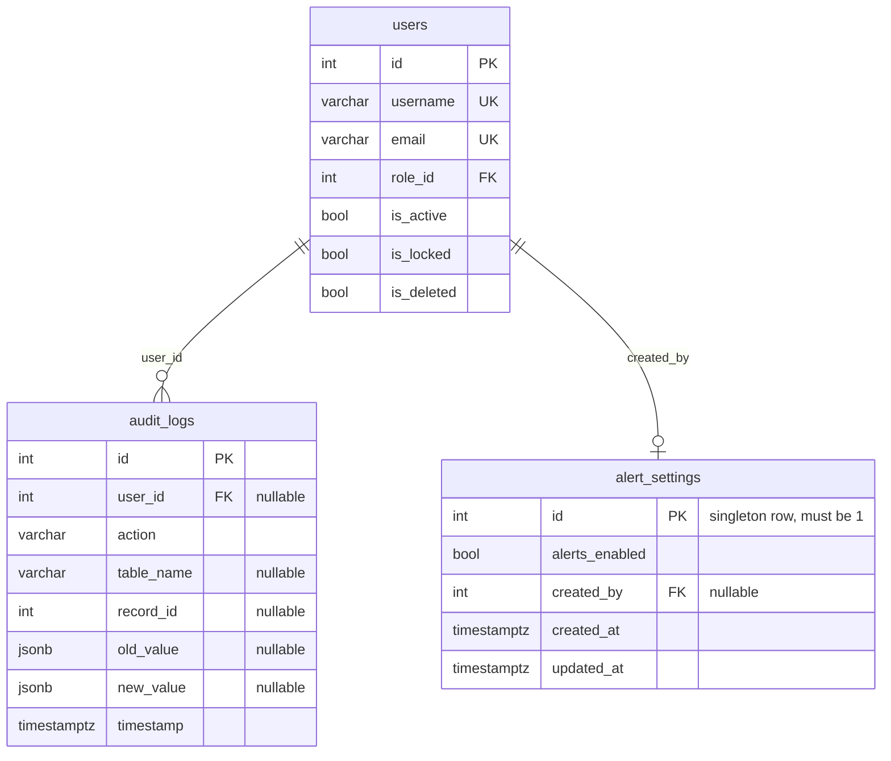

# Admin and Governance ER Diagram

[Back to ERD Index](index.md)

## Tables

| Table | Description |
|---|---|
| `audit_logs` | Append-style operational audit trail consumed by the admin audit viewer. |
| `alert_settings` | Singleton dashboard alert configuration used to globally enable or disable alert generation. |

## Read Models
- Admin search does not create new tables; it queries `customers`, `suppliers`, `sales_orders`, `production_orders`, `batch_inventories`, and `dispatch_orders`.
- Admin summary and analytics endpoints are read models over existing sales, purchase, stores, production, quality, maintenance, dispatch, and user tables.

## Key Rules
- `alert_settings.id` is constrained to `1`, enforcing a single configuration row.
- Audit log viewer remains read-only from the admin API layer.
- Alerts are operational summaries derived from low stock, open breakdowns, pending dispatch, and open NCR conditions.