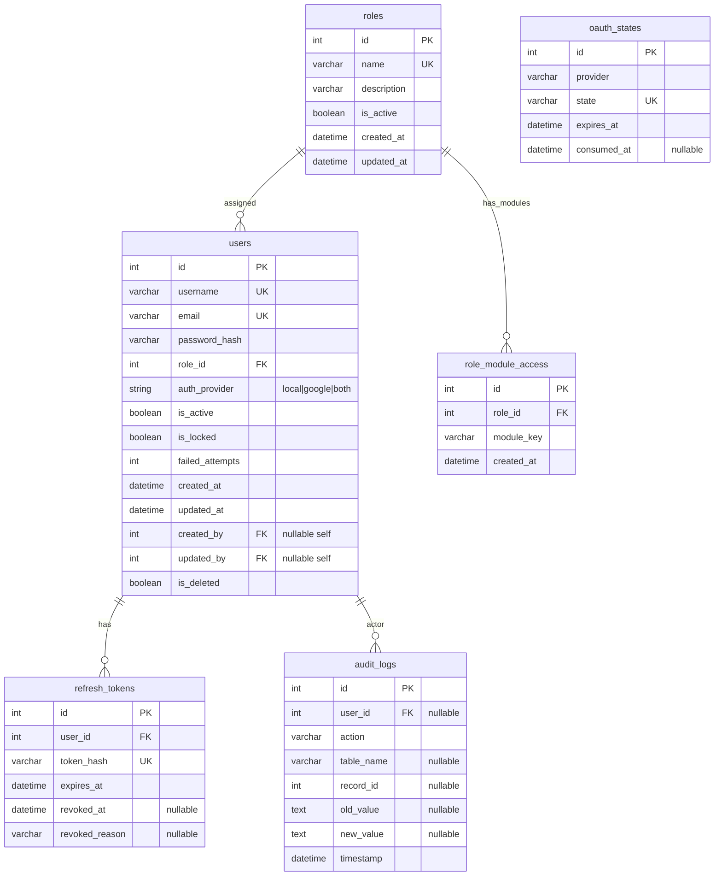

# Auth and RBAC ER Diagram

[Back to ERD Index](index.md)

## Notes
- `oauth_states` is standalone state-tracking for OAuth flow and does not reference `users`.
- `role_module_access` enables admin-approved multi-module access per role.
- Current valid module keys include `auth`, `users`, `roles`, `sales`, `purchase`, `stores`, `engineering`, `quality`, `production`, `maintenance`, and `dispatch`.
- Default business-role mappings include `Sales`, `Purchase`, `Stores`, `Engineering`, and `Production`.
- Inactive roles block authentication and protected API access even if the user record itself is active.
- User creation and role/module management are admin-governed operations; there is no public registration route in the current backend.

## Navigation
- Previous: [Purchase ERD](purchase-erd.md)
- Next: [Engineering ERD](engineering-erd.md)
- Index: [ER Diagram Index](index.md)
