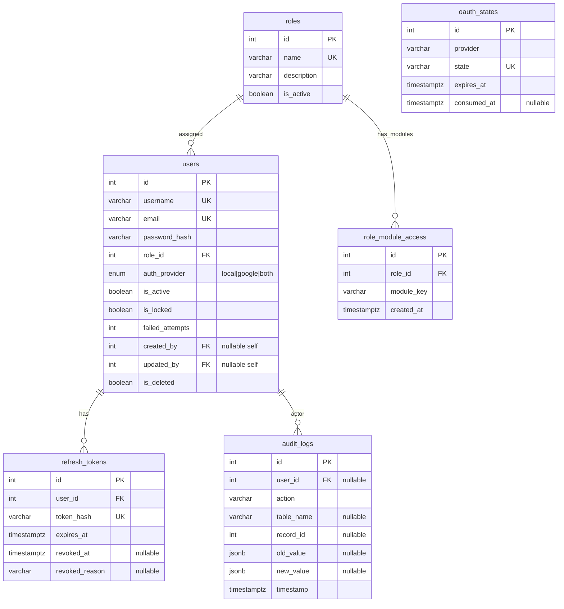

# Auth & RBAC ER Diagram

[← Back to ERD Index](index.md)

## Notes
- `oauth_states` is standalone state-tracking for OAuth flow (no FK to users).
- `role_module_access` enables multi-module permissions per role.
