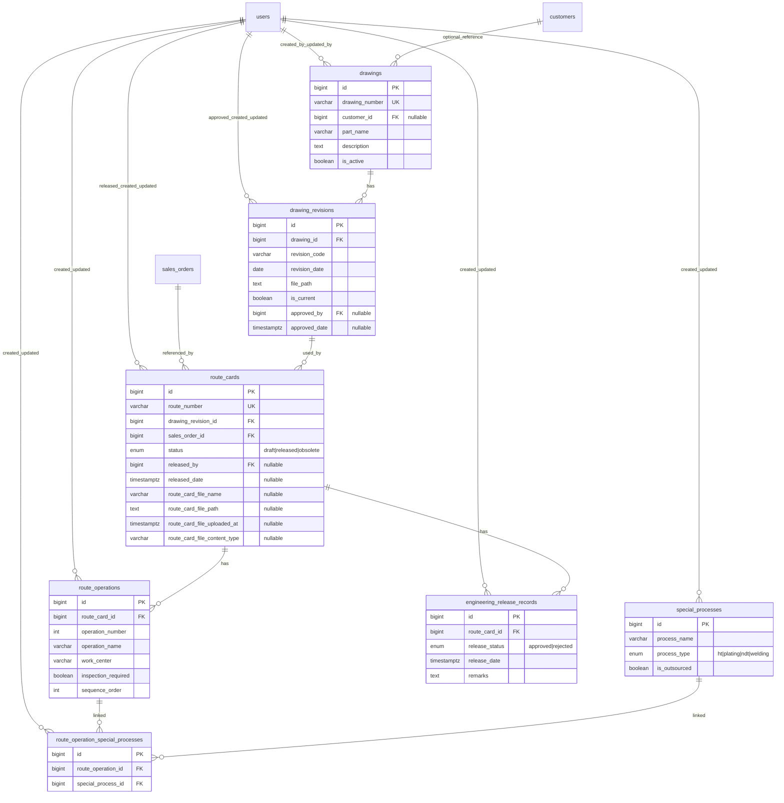

# Engineering Module ER Diagram

[← Back to ERD Index](index.md)

## Notes
- Uploaded/Imported Route Card PDFs are stored in a dedicated folder: `imports/route_cards`.
- `route_cards` stores document metadata (`route_card_file_name`, `route_card_file_path`, `route_card_file_uploaded_at`, `route_card_file_content_type`) for controlled download and traceability.

## Navigation
- Previous: [Auth & RBAC ERD](auth-rbac-erd.md)
- Next: [Sales ERD](sales-erd.md)
- Index: [ER Diagram Index](index.md)
