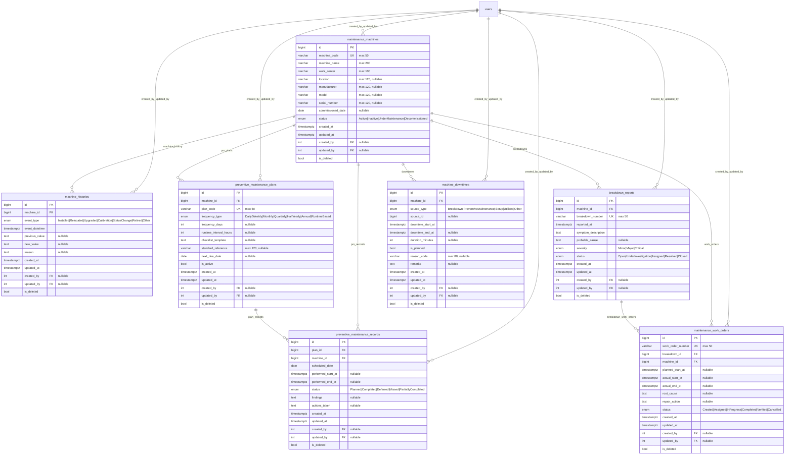

# Maintenance Module ER Diagram

[Back to ERD Index](index.md)

## Tables

| Table | Description |
|---|---|
| `maintenance_machines` | Machine master for maintenance-tracked equipment. Tracks status lifecycle (Active, Inactive, UnderMaintenance, Decommissioned). |
| `machine_histories` | Immutable audit trail of machine lifecycle events (installation, relocation, calibration, status changes). |
| `preventive_maintenance_plans` | Scheduled preventive maintenance plans per machine with configurable frequency. |
| `preventive_maintenance_records` | Individual PM execution records linked to plans. |
| `breakdown_reports` | Unplanned breakdown incidents with severity classification. |
| `maintenance_work_orders` | Corrective work orders raised from breakdown reports. |
| `machine_downtimes` | Downtime records for both planned (PM) and unplanned (breakdown) events. |

## Key Relationships
- All child tables cascade-delete from `maintenance_machines`.
- `preventive_maintenance_records` link to both the parent plan and the machine.
- `maintenance_work_orders` link to both the originating breakdown report and the machine.
- `machine_downtimes.source_id` is a polymorphic reference (not enforced via FK) to breakdowns or PM records based on `source_type`.
- All tables carry `created_by`/`updated_by` audit columns referencing `users.id`.

## Cross-Module Integration
- Production service validates machine maintenance status before starting operations. If a maintenance machine has status `UnderMaintenance`, production operation start is blocked.
