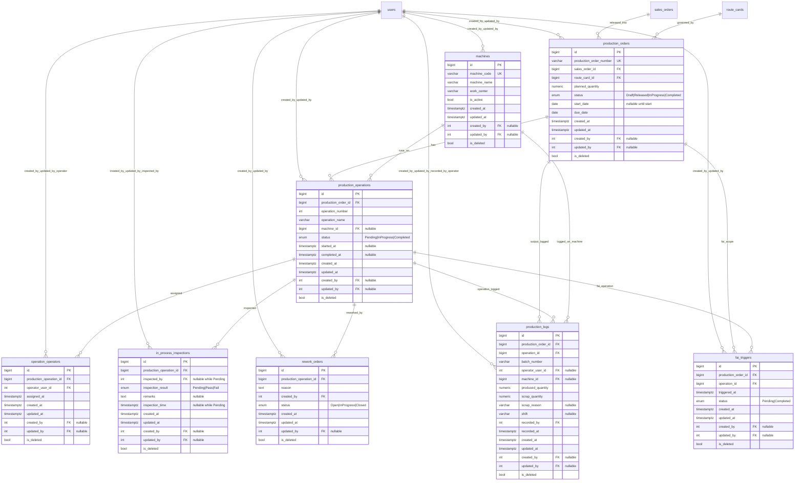

# Production Module ER Diagram

[Back to ERD Index](index.md)

## Constraints
- Primary keys: `id` on every Production table.
- Unique keys: `production_orders.production_order_number`, `machines.machine_code`, `production_operations (production_order_id, operation_number)`, `operation_operators (production_operation_id, operator_user_id)`, `fai_triggers (production_order_id, operation_id)`.
- Foreign keys:
  - `production_orders.sales_order_id -> sales_orders.id`
  - `production_orders.route_card_id -> route_cards.id`
  - `production_operations.production_order_id -> production_orders.id`
  - `production_operations.machine_id -> machines.id`
  - `operation_operators.production_operation_id -> production_operations.id`
  - `operation_operators.operator_user_id -> users.id`
  - `in_process_inspections.production_operation_id -> production_operations.id`
  - `in_process_inspections.inspected_by -> users.id`
  - `rework_orders.production_operation_id -> production_operations.id`
  - `rework_orders.created_by -> users.id`
  - `production_logs.production_order_id -> production_orders.id`
  - `production_logs.operation_id -> production_operations.id`
  - `production_logs.recorded_by -> users.id`
    - `production_logs.operator_user_id -> users.id`
    - `production_logs.machine_id -> machines.id`
  - `fai_triggers.production_order_id -> production_orders.id`
  - `fai_triggers.operation_id -> production_operations.id`
- Check constraints recommended for implementation:
  - `planned_quantity > 0`
  - `operation_number > 0`
  - `start_date IS NULL OR due_date >= start_date`
  - `completed_at IS NULL OR started_at IS NOT NULL`
  - `produced_quantity >= 0`
  - `scrap_quantity >= 0`
  - `produced_quantity + scrap_quantity > 0`

## Business Rules
- `ProductionOrder` cannot move to `InProgress` unless the linked `RouteCard` is already `released`.
- `ProductionOperation` cannot move to `Completed` unless the latest active `InProcessInspection` result is `Pass`.
- `ReworkOrder` must be created when an in-process inspection result is `Fail`.
- Multiple operators per operation are supported through `operation_operators`.
- The sum of non-deleted `production_logs.produced_quantity` for a production order cannot exceed `production_orders.planned_quantity`.

## Design Notes
- All Production tables follow the same audit and soft-delete pattern already used elsewhere in the repo: `created_at`, `updated_at`, `created_by`, `updated_by`, `is_deleted`.
- `machine_id` is marked nullable in the design so manual or externally processed operations can still be represented without inventing placeholder machine masters.
- Design choice: `in_process_inspections` allows multiple records per operation for traceability; completion checks should evaluate the latest non-deleted inspection row.
- `operation_operators.operator_user_id` should be validated in the service layer against users who hold Production access; the database can only enforce the FK to `users.id`.
- `production_orders.sales_order_id` should match the `sales_order_id` already linked on the referenced `route_cards` row.
- `production_logs.operation_id` and `fai_triggers.operation_id` should belong to the same `production_order_id` supplied on the row.

## Navigation
- Previous: [Engineering ERD](engineering-erd.md)
- Next: [Sales ERD](sales-erd.md)
- Index: [ER Diagram Index](index.md)
