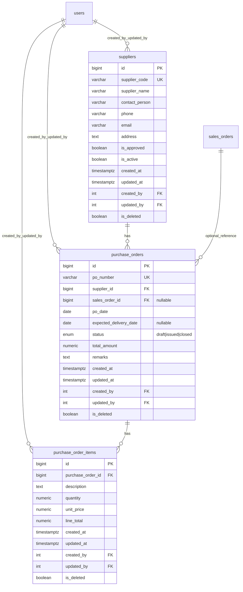

# Purchase Module ER Diagram

This ERD reflects the current Purchase module backend.

## Notes
- Soft delete is implemented using `is_deleted` on all Purchase tables.
- `purchase_orders.status` lifecycle: `draft -> issued -> closed`.
- `purchase_order_items` are editable only while PO is in `draft`.
- `total_amount` is recalculated from non-deleted PO items.
