# Quality Module ER Diagram

[Back to ERD Index](index.md)

```mermaid
erDiagram
    users ||--o{ incoming_inspections : inspected_by_created_by_updated_by
    users ||--o{ in_process_inspections : inspected_by_created_by_updated_by
    users ||--o{ final_inspections : inspected_by_created_by_updated_by
    users ||--o{ fai_reports : inspected_by_created_by_updated_by
    users ||--o{ ncrs : reported_by_created_by_updated_by
    users ||--o{ capas : responsible_person_created_by_updated_by
    users ||--o{ root_cause_analyses : created_by_updated_by
    users ||--o{ gauges : created_by_updated_by
    users ||--o{ audit_plans : auditor_created_by_updated_by
    users ||--o{ audit_reports : created_by_updated_by
    users ||--o{ management_review_meetings : created_by_updated_by
    users ||--o{ certificates_of_conformance : issued_by

    grns ||--o{ incoming_inspections : source_grn
    grn_items ||--o{ incoming_inspections : source_grn_item
    production_operations ||--o{ in_process_inspections : operation_inspection
    production_orders ||--o{ final_inspections : final_acceptance
    production_orders ||--o{ fai_reports : fai_scope
    ncrs ||--o{ capas : corrective_actions
    ncrs ||--o{ root_cause_analyses : investigations
    gauges ||--o{ inspection_measurements : measurement_gauge
    production_orders ||--o{ certificates_of_conformance : certificate_scope
    audit_plans ||--o{ audit_reports : audit_output

    incoming_inspections {
        bigint id PK
        bigint grn_id FK
        bigint grn_item_id FK
        int inspected_by FK
        enum status "Pending|Accepted|Rejected"
        text remarks "nullable"
        timestamptz inspected_at "nullable"
        timestamptz created_at
        timestamptz updated_at
        int created_by FK "nullable"
        int updated_by FK "nullable"
        bool is_deleted
    }

    in_process_inspections {
        bigint id PK
        bigint production_operation_id FK
        int inspected_by FK
        enum status "Pending|Accepted|Rejected"
        text remarks "nullable"
        timestamptz inspected_at "nullable"
        timestamptz created_at
        timestamptz updated_at
        int created_by FK "nullable"
        int updated_by FK "nullable"
        bool is_deleted
    }

    final_inspections {
        bigint id PK
        bigint production_order_id FK
        int inspected_by FK
        enum status "Pending|Accepted|Rejected"
        text remarks "nullable"
        timestamptz inspected_at "nullable"
        timestamptz created_at
        timestamptz updated_at
        int created_by FK "nullable"
        int updated_by FK "nullable"
        bool is_deleted
    }

    fai_reports {
        bigint id PK
        bigint production_order_id FK
        varchar drawing_number
        varchar revision
        varchar part_number
        int inspected_by FK
        date inspection_date
        enum status "Pending|Accepted|Rejected"
        varchar attachment_path "nullable"
        timestamptz created_at
        timestamptz updated_at
        int created_by FK "nullable"
        int updated_by FK "nullable"
        bool is_deleted
    }

    ncrs {
        bigint id PK
        varchar reference_type
        bigint reference_id
        int reported_by FK
        timestamptz reported_date
        enum defect_category "Material Defect|Process Deviation|Documentation|Dimensional|Other"
        text description
        enum status "Open|InProgress|Closed"
        timestamptz created_at
        timestamptz updated_at
        int created_by FK "nullable"
        int updated_by FK "nullable"
        bool is_deleted
    }

    capas {
        bigint id PK
        bigint ncr_id FK
        enum action_type "Correction|Corrective|Preventive"
        int responsible_person FK
        date target_date
        enum status "Open|InProgress|Closed"
        timestamptz created_at
        timestamptz updated_at
        int created_by FK "nullable"
        int updated_by FK "nullable"
        bool is_deleted
    }

    root_cause_analyses {
        bigint id PK
        bigint ncr_id FK
        enum method "5Why|Fishbone|8D|Other"
        text analysis_text
        timestamptz created_at
        timestamptz updated_at
        int created_by FK "nullable"
        int updated_by FK "nullable"
        bool is_deleted
    }

    gauges {
        bigint id PK
        varchar gauge_code UK
        varchar gauge_name
        date last_calibration_date
        date next_calibration_due
        enum status "Valid|Expired"
        timestamptz created_at
        timestamptz updated_at
        int created_by FK "nullable"
        int updated_by FK "nullable"
        bool is_deleted
    }

    inspection_measurements {
        bigint id PK
        enum inspection_type "Incoming|In Process|Final"
        bigint inspection_id
        varchar parameter_name
        varchar specification "nullable"
        varchar measured_value "nullable"
        enum result "Pass|Fail"
        bigint gauge_id FK "nullable"
        timestamptz created_at
    }

    certificates_of_conformance {
        bigint id PK
        bigint production_order_id FK
        varchar certificate_number
        int issued_by FK "nullable"
        date issued_date
        text remarks "nullable"
    }

    quality_metrics {
        bigint id PK
        varchar metric_name
        numeric metric_value
        date recorded_date
    }

    audit_plans {
        bigint id PK
        varchar audit_area
        date planned_date
        int auditor FK
        varchar status
        timestamptz created_at
        timestamptz updated_at
        int created_by FK "nullable"
        int updated_by FK "nullable"
        bool is_deleted
    }

    audit_reports {
        bigint id PK
        bigint audit_plan_id FK
        text findings
        varchar status
        timestamptz created_at
        timestamptz updated_at
        int created_by FK "nullable"
        int updated_by FK "nullable"
        bool is_deleted
    }

    management_review_meetings {
        bigint id PK
        timestamptz meeting_date
        text participants
        text agenda
        text minutes "nullable"
        text actions "nullable"
        timestamptz created_at
        timestamptz updated_at
        int created_by FK "nullable"
        int updated_by FK "nullable"
        bool is_deleted
    }
```

## Notes
- Quality reports are generated as PDFs under `storage/quality_reports/{fir|fai|ncr|capa|audit|traceability}`.
- Batch traceability combines Stores, Purchase, Production, and Sales references starting from a batch in inventory.
- No dedicated `dispatch` table currently exists; customer-delivery view is derived from sales order links.

## Navigation
- Previous: [Stores ERD](stores-erd.md)
- Index: [ER Diagram Index](index.md)
