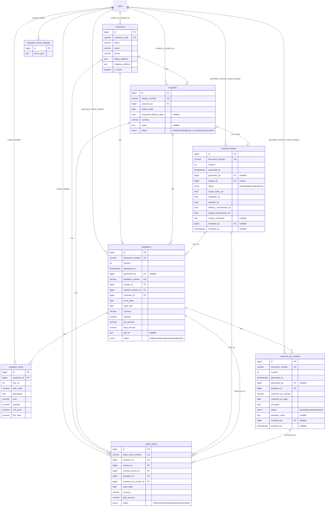

# Sales Module ER Diagram

[← Back to ERD Index](index.md)

## Notes
- Quotation creation/download is gated by all 5 contract review feasibility flags.
- `valid_until >= issue_date` is enforced at DB level for quotations.
- `quotation_items` enforces unique `(quotation_id, line_no)`.

## Navigation
- Previous: [Engineering ERD](engineering-erd.md)
- Next: [Purchase ERD](purchase-erd.md)
- Index: [ER Diagram Index](index.md)
