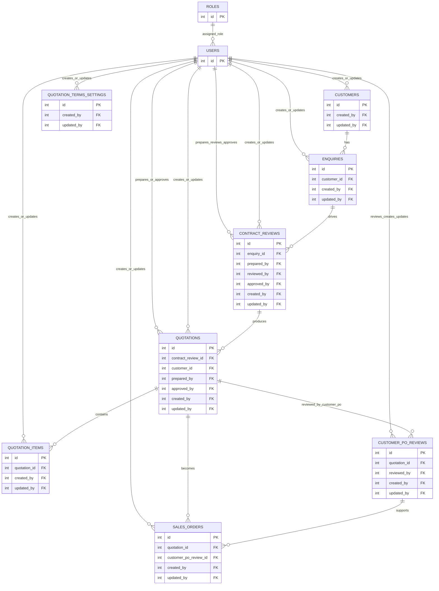

# Sales Module ER Diagram

This ERD reflects the currently validated foreign-key relationships in the Sales module.

## Notes

- `ROLES -> USERS` is included for completeness of auth/data ownership context.
- `QUOTATION_TERMS_SETTINGS` is global settings storage (not tied to a quotation row), but keeps user audit links.
- Cardinalities are modeled from FK directions currently present in the database schema.

## Contract Review Feasibility Checks

The sales flow enforces 5 mandatory contract-review checks. If any one is `False`, quotation creation and quotation PDF download are blocked.

Business label to backend field mapping:

- `drawing_available` -> `scope_clarity_ok`
- `special_process_identified` -> `capability_ok`
- `capacity_ok` -> `capacity_ok`
- `delivery_feasible` -> `delivery_commitment_ok`
- `quality_requirements_clear` -> `quality_requirements_ok`

When blocked, API returns an error listing which checkbox names are still not `True` so users can correct them before proceeding.
